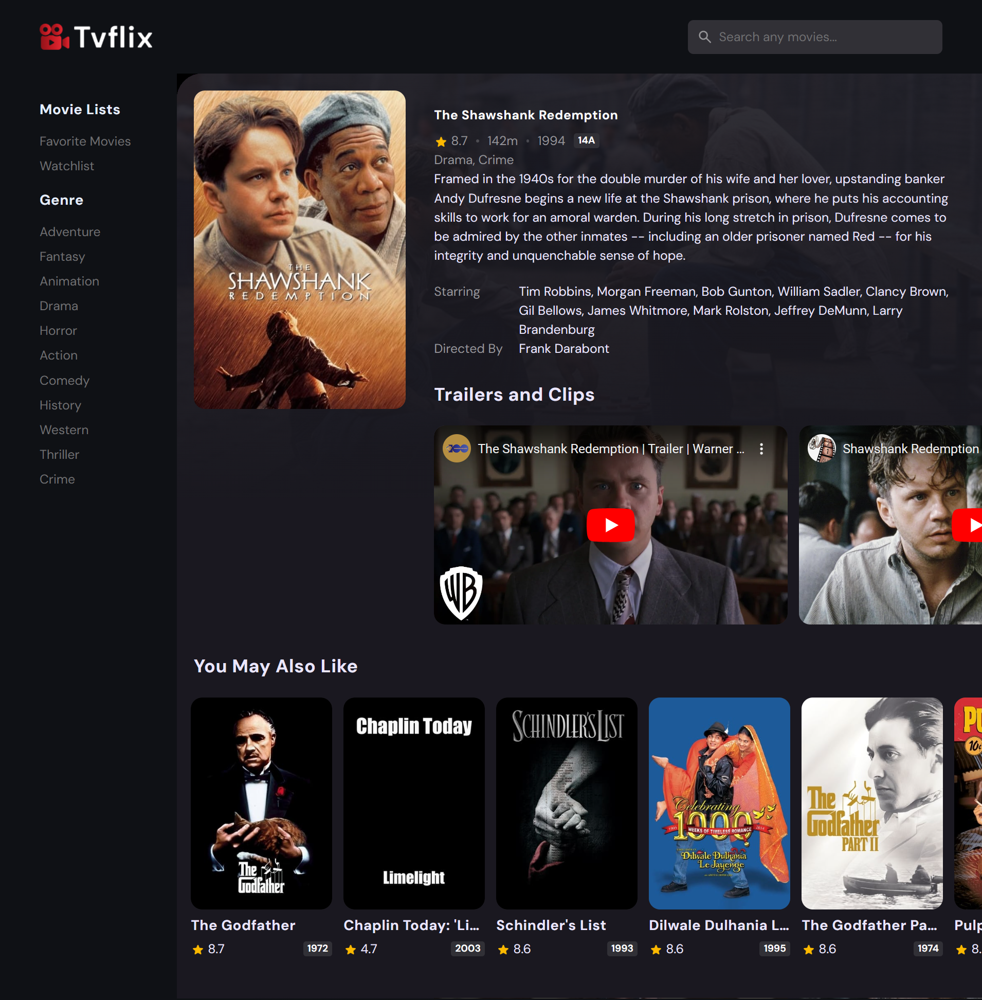

# Tvflix web app Documentation
Tvflix web app An interactive web application for discovering and exploring a wide range of movies. Browse top-rated, trending, and upcoming films, dive into detailed movie information, and curate your own watchlist and favorites. Enjoy a seamless movie exploration experience with real-time search, responsive design, and user-friendly features.

[Tvflix](https://omar-mazen.github.io/Tvflix/)
## Table of Contents
1. [Introduction](#introduction)
2. [Getting Started](#getting-started)
3. [Components and Structure](#components-and-structure)
4. [Styling](#styling)
5. [JavaScript Modules](#javascript-modules)
6. [Conclusion](#conclusion)
7. [Screenshots](#screenshots)
8. [Contributing](#contributing)
9. [License](#license)

## Introduction
### Purpose
Tvflix is a web application that enables users to explore, discover, and manage movies. It offers a user-friendly interface for browsing movies, accessing detailed information, and creating watchlists.

### Features
- Responsive design for various devices.
- Browse a wide range of movies.
- Browse top-rated, trending, and upcoming movies.
- Searching for a specific movie.
- View detailed information about a selected movie.
- Filter movies by genre, language, year, and rating.
- Sort movies by popularity, vote count, vote average, and release date.
- Recommended movies on the detail page.
- Create and manage watchlists and favorites

### Technologies Used
- HTML5
- CSS3
- JavaScript + (ES6)
- The Movie Database (TMDb) API

## Getting Started
### Installation
1. Clone the repository from [GitHub Repo URL].
2. Open the project folder in your code editor.
3. Launch the app by opening `index.html` in a web browser.

### Usage
- Upon opening the app, the home page displays a banner featuring popular movies.
- Utilize the sidebar for easy navigation between favorites, watchlist, and movie lists by genre and language.
- Click on a movie card to access detailed information.
- The search bar facilitates searching for specific movies.
- Manage watchlists and favorites on dedicated pages.

## Components and Structure
### Overview
Key components of the app include:
- Home Page: Features a banner and slider showcasing popular movies.
- Detail Page: Provides comprehensive information about a selected movie.
- Movie List Page: Displays movies based on filters (genre ,language ,year ,rating).
- Watchlist and Favorites Pages: Show user-specific movie lists.

### Home Page
On the home page, you'll find an eye-catching banner featuring a dynamic slider that highlights the finest movies. This slider invites users to seamlessly navigate through a collection of popular Movies, Top Rated Movies, Trending Movies, Upcoming Movies, enabling them to discover a variety of cinematic gems.

### Detail Page
Detailed information about a selected movie is presented on this page, including title, overview, genres, rating, trailers, crew and directors.

### Movie List Page
This page displays movies based on selected filters such as genre, language, year, and rating. Users can explore movies that match their preferences.

### Watchlist and Favorites Pages
These pages display movies added to watchlists and favorites by the user. Movies can also be removed from these lists.

## Styling
### CSS Structure
The app's styling is organized into sections:
- Custom Properties for consistent colors, typography, and transitions.
- Reset Styles to normalize default browser styles.
- Global Styles for layout and typography.
- Component-specific styles for Header, Sidebar, Banner, Movie Cards, and more.

### Custom Properties
Custom properties ensure consistent styling across the app, simplifying global design updates.

### Responsive Design
Media queries ensure the app's responsiveness on various devices. The layout adapts for an optimal user experience.

## JavaScript Modules
### `global.js`
Contains globally used utility functions and variables that are shared among different parts of the application.

### `api.js`
This module is responsible for handling API requests to fetch movie data from the TMDb API. It abstracts the data retrieval process and provides methods to interact with the API endpoints.

### `movie-card.js`
This module generates movie cards that display movie details and icons for adding/removing movies from the watchlist and favorites. It contributes to a consistent presentation of movie information across the app.

### `search.js`
Implements the search functionality throughout the app, enabling users to search for movies based on keywords.

### `sidebar.js`
Manages the functionality of the sidebar, including genre filters, language filters, and the ability to toggle sidebar visibility. It enhances user experience by providing intuitive navigation options.

### `index.js`
Initializes the core functionality of the Movie Discovery App on the home page (index.html). Manages the display of top-rated, trending, and upcoming movies.

### `detail.js`
Manages the functionality of the detailed movie view page (detail.html). Displays the selected movie's details and 

### `movie-list.js`
This module governs the behavior of the movie list page. It handles filters by genre, language, year, and sorting options like popularity, vote count, vote average, and release date.

### `watchlist.js`
Handles the display and functionality of the watchlist page. It interacts with the localStorage to manage the user's saved movies and updates the UI accordingly.

### `favorites.js`
Similar to watchlist.js, this module handles the display and functionality of the favorites page. It allows users to manage their list of favorite movies.

## Conclusion
### Summary
Tvflix empowers users to explore, discover, and manage movies. Its intuitive interface and responsive design enable users to find and create personalized watchlists and favorites.

## Screenshots

### Home page on desktop

### Home page on mobile

### details page on desktop

### details page on mobile

### movie list page on desktop

### movie list page on mobile

### watchlist page on desktop

### watchlist pageon mobile

### favorites pag on desktop

### favorites page on mobile

## Contributing
We welcome contributions to enhance the project! If you find any issues or have ideas for improvements, please don't hesitate to report them through GitHub issues. You can also suggest enhancements or submit pull requests to help make this project even better.

## License
This project is distributed under the GNU General Public License (GPL). You can find the full text of the license in the [LICENSE](https://github.com/omar-mazen/Tvflix/blob/main/LICENSE) file.
